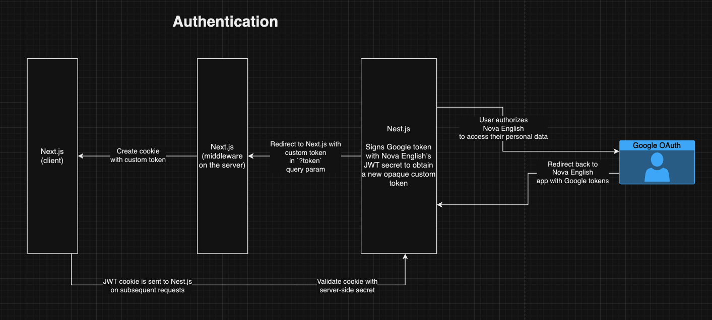

# Nova Platform API Docs

This is the official documentation for the Nova Platform API. The Nova Platform API is a RESTful API that allows you to interact with the Nova Platform powering various educational products.

All diagrams: https://drive.google.com/file/d/1YB-J0ERmViDB19qaKqOs9ASoyylDpZxG/view?usp=drive_link

## Tech Stack

- Typescript
- Nest.js
- ORM: Prisma
- Database: PostgreSQL

## Setting up dev environment

1. Create `.env.development.local` based on `.env.example` and fill in the necessary environment variables. Ask your team for help if you are unsure about what to fill in.
2. Run `npm install` to install the necessary dependencies.
3. Ensure you have Docker up and running.
4. Run `npm run dev` (for Windows `npm run dev:bash`) to start the development server. This should start Docker Compose and run the API Gateway on `http://localhost:3000` and microservices on other `localhost` ports.
5. To get the token for development, you can issue a POST request with a payload of `name` and `email` to `http://localhost:3000/api/v1/auth/token` and get back a dev token that has access to all private endpoints. This token will work only in development environment and is good for API development. If you are a frontend or full-stack developer, spin up a frontend app and log in via Google as usual.

## Authentication

## Prisma Migration

This section describes the Prisma migration commands used in our project.

#### Commands Overview

##### First you need to create migration:

##### `npm run migration:create`
Generates a new migration file without applying it to the database. This is useful for creating migration files when you want to review them or apply them manually later.

##### After that you can run migration locally:

##### `npm run migrate:dev`
Generates and applies a migration to the local development database, used during active development.

##### And apply all pending migrations to your production database (if needed):

##### `npm run migrate:prod`
Applies all pending migrations to the production or staging database, used during deployment.

#### Be aware
You want to avoid using auto synchronization (e.g. "sync: true") because it may lead to problems and forgetting to generate migrations.

